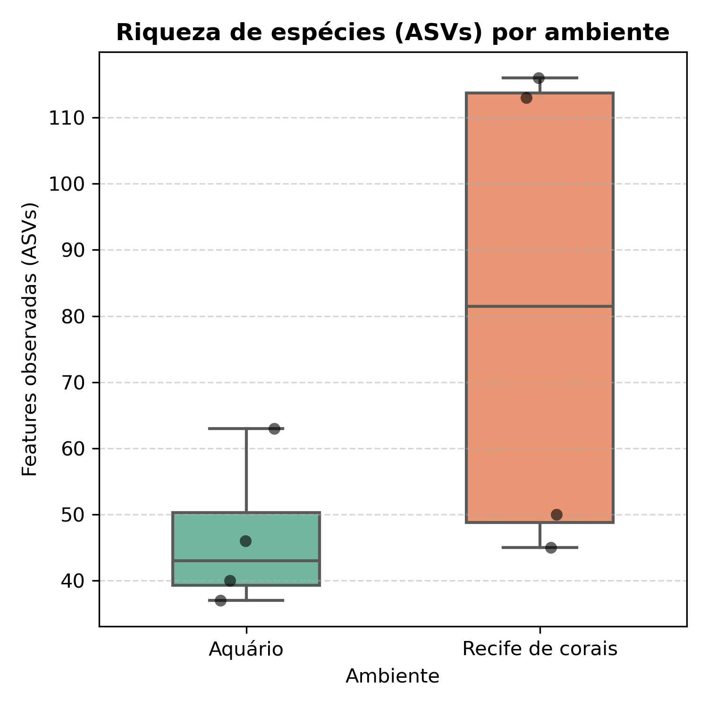
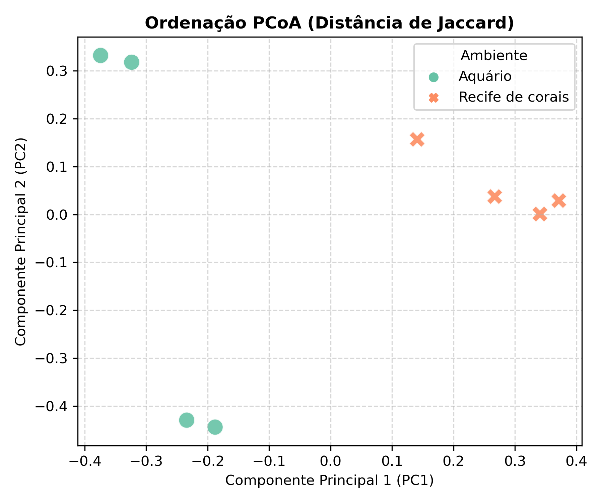
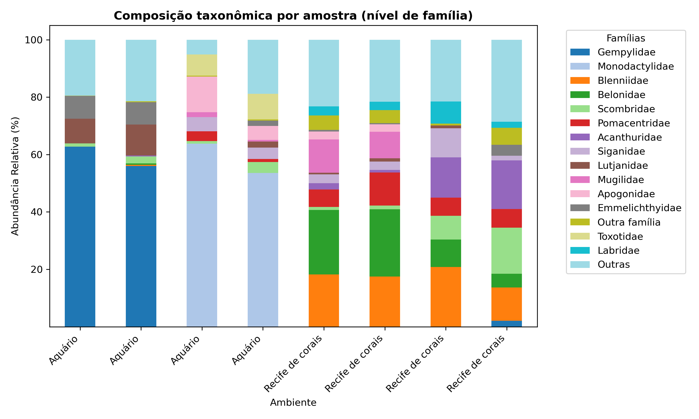

# 🧬 Pipeline de Metabarcoding de eDNA (12S rRNA - MiFish)

Este repositório contém o pipeline bioinformático automatizado e os scripts de análise estatística downstream utilizados para comparar a composição e a diversidade da comunidade de peixes entre um ambiente natural (**Recife de Corais**) e um ambiente artificial controlado (**Aquário**). 

O projeto foi desenvolvido dentro do escopo da disiciplina de Bioinformática 2026.1 do Programa de Pós-Graduação em Sistemática, Uso e Conservação da Biodiversidade (PPGSis) da Universidade Federal do Ceará (UFC).

Foram utilizados dados públicos de sequenciamento de DNA ambiental (eDNA) e a ferramenta core **QIIME 2** para a resolução de Variantes de Sequência de Amplicons (ASVs).

---

## 📊 Desenho Amostral e Dados

* **Fonte dos Dados:** Dados brutos de sequenciamento *paired-end* depositados no **DDBJ** (DNA Databank of Japan).
* **Esforço Amostral:** $n = 8$ corridas pareadas (IDs: `DRR030421` a `DRR030428`):
  * 4 amostras de ambiente natural (Recife de corais);
  * 4 amostras de ambiente artificial (Aquário);
* **Marcador Molecular:** Região do gene mitocondrial **12S rRNA** (~170 pb).
* **Primers utilizados:** MiFish (https://doi.org/10.1098/rsos.150088).

---

## 🚀 Estrutura do Pipeline (Scripts Shell)

O processamento foi totalmente automatizado e dividido em blocos lógicos numerados para garantir a reprodutibilidade do pipeline:

```text
├── 01_download_ddbj_sra_by_exp.sh   # Download automatizado dos arquivos .fastq.gz do DDBJ
├── 02_generate_metadata_files.sh    # Criação e validação do arquivo de metadados das amostras
├── 03_qiime2_import_data.sh         # Importação dos dados brutos para artefatos do QIIME 2 (.qza)
├── 04_demux_summarize.sh            # Inspeção inicial do perfil de qualidade das leituras (Phred)
├── 05_run_cutadapt.sh               # Remoção dos primers MiFish das extremidades
├── 06_demux_summarize.sh            # Verificação de qualidade pós-remoção de primers
├── 07_run_dada2.sh                  # Filtragem, denoising, merge (overlap ~65pb) e remoção de quimeras
├── 08_view_dada2.sh                 # Inspeção das taxas de retenção de sequências do DADA2
├── 09_download_ref_db.sh            # Download da base de dados taxonômica especializada Mitohelper
├── 10_train_taxonomy_classifier.sh  # Treinamento do classificador Naive Bayes para a região do 12S
├── 11_run_taxonomy_classifier.sh    # Atribuição taxonômica das ASVs com o classificador treinado
├── 12_view_taxonomy.sh              # Visualização interativa da composição taxonômica
├── 13_diversity.sh                  # Rarefação (45k reads), cálculo de Diversidade Alfa e Beta (Jaccard)
└── 14_export.sh                     # Exportação das matrizes de abundância e taxonomia para análise downstream
```
---

## 🛠️ Parâmetros Críticos do Processamento

Para fins de reprodutibilidade, as principais decisões metodológicas aplicadas nos scripts foram:
* **`cutadapt`:** Remoção estrita dos primers nas regiões *Forward* e *Reverse*.
* **`DADA2`:** Truncamento das leituras *Forward* em **115 pb** e *Reverse* em **120 pb**, garantindo uma zona de sobreposição (*overlap*) segura de aproximadamente 65 pb para o *merge*.
* **Mitohelper:** Base de dados curada e especializada para o fragmento mitocondrial 12S.
* **Rarefação:** Fixada em **45.000 reads por amostra** para normalização do esforço amostral de diversidade.

---

## 📈 Análise Downstream (Python)

Os arquivos exportados pelo QIIME 2 foram processados em ambiente Jupyter Notebook (Python 3) utilizando as bibliotecas `pandas`, `matplotlib` e `seaborn` para gerar:
1. **Gráfico de Rarefação:** Validação da saturação do sequenciamento.
2. **Boxplot de Diversidade Alfa:** Comparação da Riqueza de ASVs observadas (Mediana de ~80 para Recife vs. ~40 para Aquário).
3. **Ordenação PCoA (Distância de Jaccard):** Visualização do agrupamento comunitário, validado estatisticamente via **PERMANOVA** ($\text{Pseudo-F} = 1,73$; $p = 0,031$).
4. **Gráfico de Barras Empilhadas:** Perfil taxonômico em nível de Família focado nas top 15 famílias abundantes e agrupamento em "Outros" (corrigido para fechamento exato em 100%).

---

## 🧰 Pré-requisitos

Para rodar este pipeline, você precisará de:
* Ambiente Linux/Unix (Bash)
* QIIME 2 (versão utilizada: `2024.10.1`)
* Python 3.x (`pandas`, `matplotlib`, `seaborn`)
* Ferramentas de terminal: `wget` ou `curl`, `sra-tools`

---

## 🧑‍💻 Como Executar

Os scripts foram desenhados para serem executados sequencialmente. Certifique-se de dar permissão de execução antes de iniciar o pipeline:

```bash
# Dar permissão de execução para todos os scripts shell
chmod +x *.sh

# Executar sequencialmente do 01 ao 14
./01_download_ddbj_sra_by_exp.sh
# Prossiga sequencialmente executando os demais scripts até o 14_export.sh
```

---

---

## 📊 Galeria de Resultados

Os principais resultados gerados pelas análises downstream em Python podem ser visualizados abaixo:

<p align="center">
  
  
</p>

<p align="center">
  
</p>